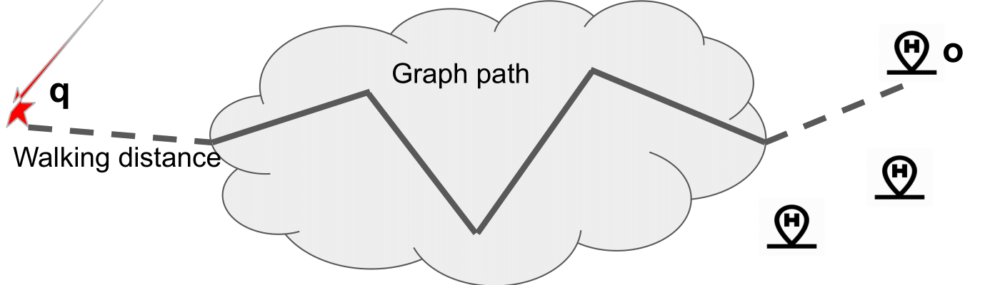
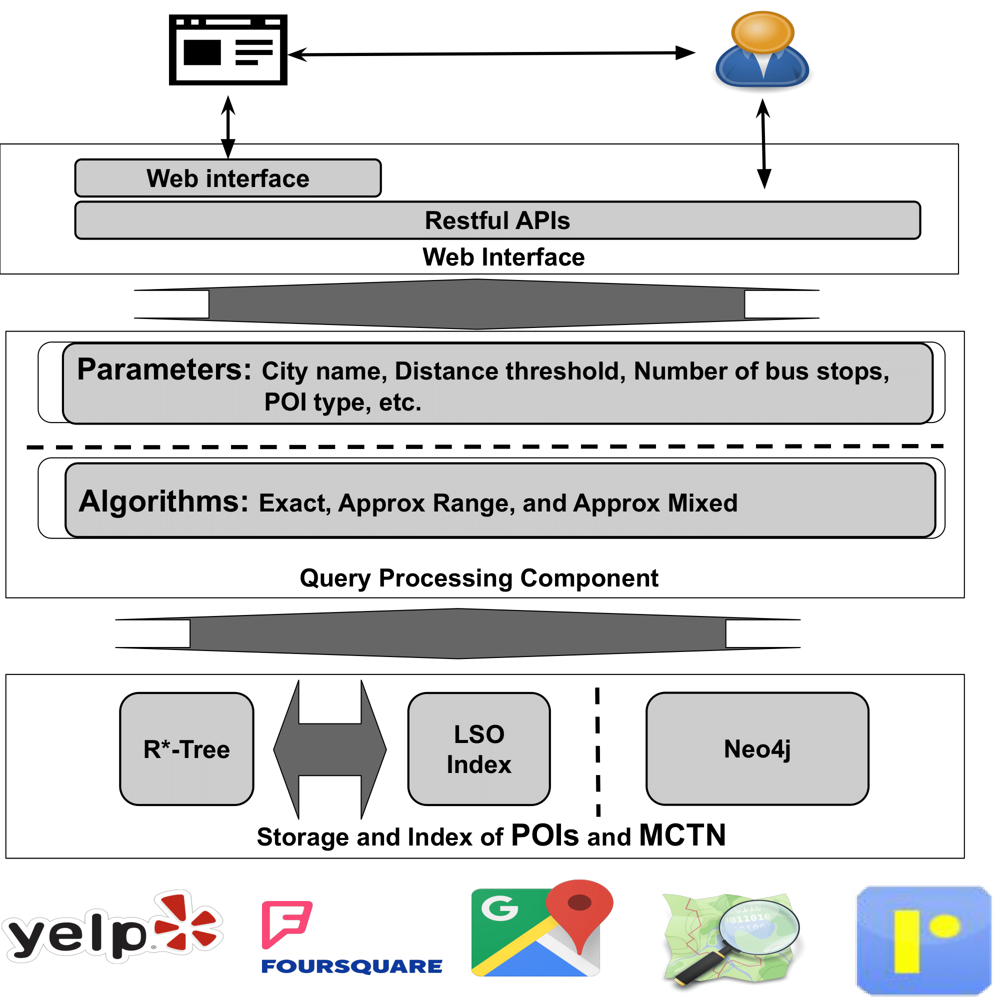
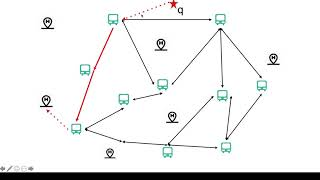

# CSQ System: A System to Support Constrained Skyline Queries on Transportation Networks
This repository is the source code for our paper "Gong, Q., Jiefei Liu and H. Cao. “CSQ System: A System to Support Constrained Skyline Queries on Transportation Networks.” 2020 IEEE 36th International Conference on Data Engineering (ICDE) (2020): 1746-1749".
A demo for the ICDE paper on constrained skyline query (CSQ) over multi-cost transportation network (MCTN).
This is the implementation of a system to answer [constrained skyline query on multi-costs transportation network (MCTN-constrained CSQ)](https://ieeexplore.ieee.org/document/8731518/), namely CSQ system([https://ieeexplore.ieee.org/document/9101829/](https://ieeexplore.ieee.org/document/9101829/)). Given a multi-cost transportation network (MCTN) and a list of POI objects D (could be on/off the MCTN), this system is implemented as a web application, which allows users to input a query point from a web interface, get the skyline result by using several algorithms, and display the result on the web interface.  
Besides all the index version of the improved exact approach and two approximate methods are implemented following the original work of [MCTN-constrained CSQ](https://ieeexplore.ieee.org/document/8731518/), we optimized the algorithms for practicality especially.
In detail, the CSQ system 1) accepts a query point could not be in the list of POI objects and 2) adds one more constraint to the search algorithms by constraining the length of graph paths. 

<p align="center" style="width: 350;height: 50px">
  
</p>

## Requirements 
- Neo4j,[https://neo4j.com/](https://neo4j.com/), our code embedded Neo4j ([https://neo4j.com/docs/java-reference/current/java-embedded/](https://neo4j.com/docs/java-reference/current/java-embedded/)) to our JAVA code. So there is no need to install the neo4j physically. 
- [Apache Maven](https://maven.apache.org/)
- [Apache commons-io](http://commons.apache.org/proper/commons-io/)
- [Apache commons-math3](https://commons.apache.org/proper/commons-math/)
- JAVA 8
- [Tomcat v9.0.20](https://archive.apache.org/dist/tomcat/tomcat-9/v9.0.20/bin/)

## Architecture
<p align="center" style="width: 5%;height: 5%;">
  
</p>


## Preprocess & Installation
### Preprocess road network data and POI object data
We explain and demonstrate the CSQ system on datasets of three cities (New York City, Los Angeles and San Francisco). The details of the datasets can be found in our paper. In order to save spaces, we only uploaded raw files of the datasets under the folder ```Data```.
- The graph DBs are created by calling the main function of the ```cs.nmsu.edu.demo.neo4jTools.createDB.java```. The road network information is read from ```NodeInfo.txt``` and ```SegInfo.txt```. The DBs are generated under ```Data\Neo4jDB_files``` with the city names. 
- The POIs objects are stored by using the R-star tree (```.rtr```) and Object information ```.txt```, which are created by calling the main function of the ```cs.nmsu.edu.demo.utilities.SeparateRealData```. The POI objects for each type and each city are stored separately. 
- The index is created under the folder ```Data\index``` by calling the ```cs.nmsu.edu.demo.methods.Index```.  

### Compile
Execute the maven command, ```mvn clean install```, The war file is generated in the *'target'* folder. The war is put the ```webapps``` folder where the Tomcat installed. 

### Implemented MCTN-constrained skyline queries approaches
We implemented the index version of the exact improved method and two approximate approaches (```approxRange``` and ```approxMixed```).  

**The details information and usage about the data process and detail information of the methods can be found on [MCTN-constrained CSQ](https://ieeexplore.ieee.org/document/8731518/) and [ICDE_ConstrainSkylineQuery](https://github.com/gongwolf/ICDE2019_CSQ).***

## Query from URL 
As the figure shows, the CSQ also provide the RESTFUL webservice to conduct the MCTN-constrained skyline query, which are listed as below.
>- ```http://localhost:8080/ICDE2020CSQDemo/rest/query/approxRangeIndexedById/{city}/{id}/{threshold}/{type:.*}/{num_bus_stop:.*} ```
>- ```http://localhost:8080/ICDE2020CSQDemo/rest/query/approxRangeIndexedByLocation/{city}/{lat}/{lng}/{threshold}/{type:.*}/{num_bus_stop:.*}``` 
>- ```http://localhost:8080/ICDE2020CSQDemo/rest/query/approxMixedIndexedById/{city}/{id}/{threshold}/{type:.*}/{num_bus_stop:.*} ```
>- ```http://localhost:8080/ICDE2020CSQDemo/rest/query/approxMixedIndexedByLocation/{city}/{lat}/{lng}/{threshold}/{type:.*}/{num_bus_stop:.*}``` 
>- ```http://localhost:8080/ICDE2020CSQDemo/rest/query/ExactImprovedIndex/{city}/{id}/{type	:.*}/{num_bus_stop:.*}``` 
>- ```http://localhost:8080/ICDE2020CSQDemo/rest/query/ExactImprovedIndex/{city}/{lat}/{lng}/{type:.*}/{num_bus_stop:.*} ```

The web APIs accept two ways to identify the query object/point. The first way is given by the object ID from the POI objects list. The second way is specified by the coordinates. Moreover, the city name, the type of POI, the distance threshold and the number bus stops can be given. The detail of the parameters are listed in the following table.  

Parameter | Description 
------------ | --------------
City name | The city where the query happens
POI Type | The type of the desired skyline answer-objects
Distance threshold | The maximum distance that a user is willing to walk from the query point to the starting bus stop/metro station and from the ending bus stop/metro station to a target object
Number of stops | The maximum length of a graph path

### Query URL examples: 
Query by using the approximate range index method on the city of LA, the query id is 100, the distance threshold is 1000, the type is lodging and the number of bus stop limitation is 10. 
```http://localhost:8080/ICDE2020CSQDemo/rest/query/approxRangeIndexedById/LA/100/1000/lodging/10``` 
  

Query by using the approximate mixed index method on the city of LA, the query id is 100, the distance threshold is 1000, the type is lodging and there is no limitation on the number of bus stop. 
```http://localhost:8080/ICDE2020CSQDemo/rest/query/approxMixedIndexedById/LA/100/1000/lodging/``` 


Query by using the approximate range index method on the city of LA, the query id is 100, the distance threshold is 1000, there is not limits on the the type is and the number of bus stop limitation is 10. 
```http://localhost:8080/ICDE2020CSQDemo/rest/query/approxRangeIndexedById/LA/100/1000//10``` 
  

Query by using the approximate mixed index method on the city of LA, the query id is 100, the distance threshold is 1000, there is no limitation on the type no limitation on the number of bus stop. 
```http://localhost:8080/ICDE2020CSQDemo/rest/query/approxMixedIndexedById/LA/100/1000//``` 


Query by using the improved exact method on the city of NY, the query ID is 5079 for the type food and the number of bus stop limitation is 10. The different with the approximate method, the exact query does not need the distance threshold parameter. 
```http://localhost:8080/ICDE2020CSQDemo/rest/query/ExactImprovedIndex/NY/5079/food/10``` 

  
Query by using the improved exact method on the city of NY, the query ID is 5079 for the non-limit type and non-limit bus stop.  
```http://localhost:8080/ICDE2020CSQDemo/rest/query/ExactImprovedIndex/NY/5079// ```

  

## Web Interface
Thanks @JiefeiLiu implemented the [web interface](https://github.com/JiefeiLiu/CSQ-Project).
For the CSQ system, we preload the points of interest and the public transportation networks in three cities, including New York (NY), Los Angeles (LA), and San Francisco (SF). The city is a place where the query point resides in.  
We provide 4 different ways to let users input a query point.   
In the first way, a user can type the address of the query point, the second way, a user can select the object from the list of POIs, which are already loaded, the third way, the system directly utilizes the current location of the user. The user just needs to click the GPS logo and the last approach, a user selects a query point by directly clicking a place on the Google map.   
After a user selects a query point, the user can choose different methods to find the CSQ solutions. The system implements three approaches that we proposed earlier this year.   
The first two methods, namely Mixed Approximate Method and Ranged Approximate search, are heuristic methods to return approximate solutions. The Ranged Approximate search finds approximate solutions by limiting the distances from the query point to the starting network node and the distance from the ending network node to the skyline solutions to be within a given threshold. The Mixed Approximate Method further limits the graph paths in the skyline answers.   
The last method is an exact search method. It can find all the skyline answers. However, it is very slow, and the result set is huge. Thus, it is not practical to be used in real life.   
For all three methods, we can limit the number of bus stops in the network path.  

After selecting a query point and the search method, a user needs to specify the values for 3 optional parameters.
1. The first parameter is a distance threshold denoting the maximum distance that the user’s willingness to walk from the query point to the bus stop and from the bus stop to the CSQ answer. 
2. The second parameter is the number of bus stops or metro stations denoting the maximum number of stops that a user is willing to accommodate. 
3. the third parameter is the POI type of the CSQ answer. 


## Demo Video
[](https://www.youtube.com/watch?v=O9lP0cRmo4w "demonstration of the CSQ system
")

## Acknowledgements
pecial thanks to java implementatioan fo the [R*-tree](http://chorochronos.datastories.org/?q=node/43)\[1\].  
[1] Beckmann, N., H. Kriegel, R. Schneider and B. Seeger. “The R*-tree: an efficient and robust access method for points and rectangles.” SIGMOD '90 (1990).